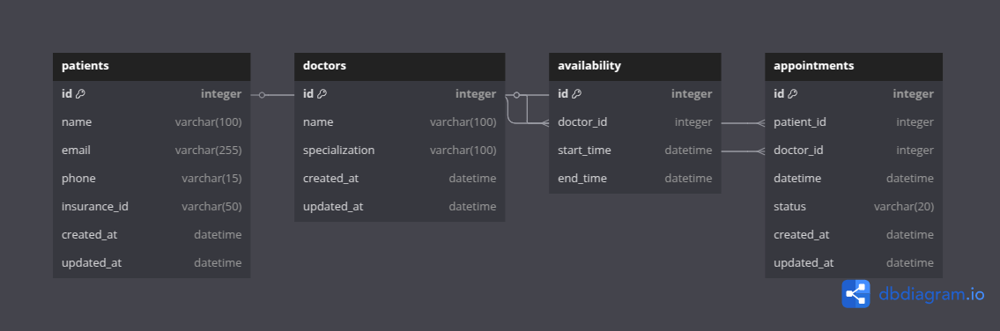
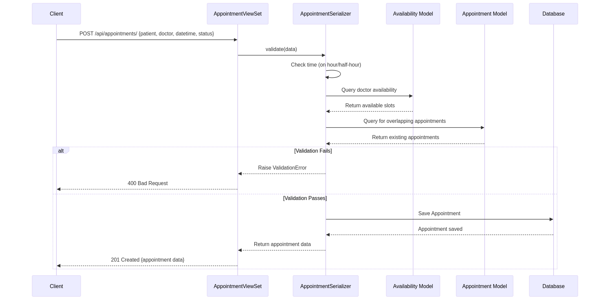

# Healthcare Appointment Scheduling System

## Overview
The Healthcare Appointment Scheduling System is a Django-based web application designed to streamline the process of scheduling appointments between patients and doctors. It provides role-based access for patients, doctors, and admins, with features like appointment booking, medical record management, and doctor availability tracking. The system uses Django REST Framework for API development, JWT for authentication, and PostgreSQL (or SQLite for testing) as the database.

### Features
- **User Roles**: Supports three roles: `patient`, `doctor`, and `admin`.
- **Authentication**: JWT-based authentication using `djangorestframework-simplejwt`.
- **Appointment Scheduling**: Patients can book appointments with doctors based on availability.
- **Medical Records**: Doctors can create and update medical records; patients can view their own records.
- **Doctor Availability**: Doctors can manage their availability slots.
- **Role-Based Access**: Admins can manage all resources, while patients and doctors have restricted access based on their roles.
- **Testing**: Comprehensive unit tests using `pytest`, `factory-boy`, and `faker`.

## Installation

### Prerequisites
- Python 3.11+
- PostgreSQL (or SQLite for development/testing)
- Virtualenv (recommended)

### Setup Instructions
1. **Clone the Repository**:
```
   bash
   git clone https://github.com/WabukoWabuko/healthcareAppointmentSchedulingSystem.git
   cd healthcare-system
```

2. **Create and Activate a Virtual Environment**:
```
bash
python3 -m venv venv
source venv/bin/activate  # On Windows: venv\Scripts\activate
```
3. **Install Dependencies**:
```
bash
pip install -r requirements.txt
```

- If requirements.txt does not exist, install the following packages:
```
bash
pip install django djangorestframework djangorestframework-simplejwt dj-rest-auth pytest pytest-django factory-boy faker psycopg2-binary
```

4. **Set Up the Database**:
- Ensure PostgreSQL is running and create a database:
```
bash
psql -U postgres
CREATE DATABASE healthcare_db;
```

- Update healthcare_system/settings.py with your database credentials:
```
bash
DATABASES = {
    'default': {
        'ENGINE': 'django.db.backends.postgresql',
        'NAME': 'healthcare_db',
        'USER': 'your_postgres_user',
        'PASSWORD': 'your_postgres_password',
        'HOST': 'localhost',
        'PORT': '5432',
    }
}
```

- For testing, you can use SQLite by setting:
```
bash
DATABASES = {
    'default': {
        'ENGINE': 'django.db.backends.sqlite3',
        'NAME': ':memory:',
    }
}
```

5. **Run Migrations**:
```
bash
python3 manage.py makemigrations
python3 manage.py migrate
```

6. **Create a Superuser (Admin)**:
```
bash
python3 manage.py createsuperuser
```

7. **Run the Development Server**:
```
bash
python3 manage.py runserver
```
- The application will be available at http://127.0.0.1:8000/.

## API Endpoints
The API endpoints are documented using Swagger/OpenAPI. After starting the server, access the API documentation at:

- Swagger UI: http://localhost:8000/api/swagger/
- ReDoc: http://localhost:8000/api/redoc/
### Authentication
- **Login (Obtain JWT Token)**:
- POST /api/auth/jwt/token/
- Payload: {"email": "user@example.com", "password": "pass123"}
- Response: {"access": "...", "refresh": "..."}

- **Refresh Token**:
- POST /api/auth/jwt/refresh/
- Payload: {"refresh": "..."}
- Response: {"access": "..."}

### Users
- **Login (via dj-rest-auth)**:
- POST /api/auth/login/
- Payload: {"email": "user@example.com", "password": "pass123"}

- **Logout**:
- POST /api/auth/logout/

### Doctors
- **List Doctors (Admin or Patient)**:
- GET /api/doctors/

- **Create Doctor (Admin only)**:
- POST /api/doctors/
- Payload: {"user": 1, "name": "Dr. Smith", "specialization": "Cardiology"}

### Availabilities
- **List Availabilities (Doctor or Admin)**:
- GET /api/availabilities/

- **Create Availability (Doctor only)**:
- POST /api/availabilities/
- Payload: {"doctor": 1, "start_time": "2025-04-03T10:00:00Z", "end_time": "2025-04-03T12:00:00Z"}

### Patients
- **List Patients (Admin or Patient)**:
- GET /api/patients/

- **Create Patient (Admin only)**:
- POST /api/patients/
- Payload: {"user": 2, "name": "John Doe", "email": "john@example.com", "phone": "1234567890", "insurance_id": "INS001"}

### Appointments
- **List Appointments (Role-based)**:
- GET /api/appointments/

- **Create Appointment (Patient only)**:
- POST /api/appointments/
- Payload: {"patient": 1, "doctor": 1, "datetime": "2025-04-03T10:30:00Z", "status": "pending"}

### Medical Records
- **List Medical Records (Role-based)**:
- GET /api/medical-records/

- **Create Medical Record (Doctor only)**:
- POST /api/medical-records/
- Payload: {"patient": 1, "appointment": 1, "diagnosis": "Hypertension", "treatment": "Prescribed medication", "notes": "Follow up in 1 month"}

- **Update Medical Record (Doctor only)**:
- PATCH /api/medical-records/<id>/
- Payload: {"notes": "Updated notes"}

## Testing
### Setup
1. Ensure test dependencies are installed:
```
bash
pip install pytest pytest-django factory-boy faker
```

2. Configure pytest.ini (already included in the project):
```
ini
[pytest]
DJANGO_SETTINGS_MODULE = healthcare_system.settings
python_files = test_*.py
```

### Run Tests
Run all tests with verbose output:
```
bash
pytest -v
```

- **Total Tests**: 25 tests across users, patients, doctors, appointments, and medical_records.
- **Coverage**: Tests cover models, serializers, and API endpoints with role-based access control.

## Documentation
- **Database Schema Diagram** (generated with dbdiagram.io):  
  

- **Sequence Diagram for Appointment Booking** (generated with Mermaid.js):  
  

## Contributing
1. Fork the repository.
2. Create a new branch (git checkout -b feature/your-feature).
3. Make your changes and commit (git commit -m "Add your feature").
4. Push to your branch (git push origin feature/your-feature).
5. Create a pull request.

## License
This project is licensed under the MIT License.

## Contact
For any inquiries, please contact the project maintainer at basilwabbs@gmail.com.
```
text
#### Step 2: Create a `requirements.txt` File
To make installation easier, let’s create a `requirements.txt` file with all the dependencies listed.

**File to Create**: `healthcare-system/requirements.txt`

txt
django==5.1.7
djangorestframework==3.15.2
djangorestframework-simplejwt==5.3.1
dj-rest-auth==6.0.0
psycopg2-binary==2.9.9
pytest==8.3.5
pytest-django==4.10.0
factory-boy==3.3.1
faker==37.1.0
```
